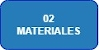

---
title: Motivaciones y objetivos
layout: default
filename: 01_motivacion.md
--- 
# Motivaciones y objetivos
Desde el año 2019, el [Instituto Nacional de Educación Tecnológica (INET)](https://www.inet.edu.ar/) entregó a distintas instituciones educativas técnicas de todo el país cerca de 6000 impresoras 3D [Overlord Pro+](https://www.dfrobot.com/product-1298.html) con la intención de fomentar el diseño y la impresión 3D.

En el año 2020, la llegada de la pandemia intensificó el uso de este tipo de equipos para la impresión de vinchas para máscaras de protección contra el virus del COVID-19. La presencia de las impresoras 3D Overlord Pro+ en las escuelas generó que muchos establecimientos fueran centros de producción de vinchas a lo largo y a lo ancho del país.

Como cualquier dispositivo de uso cotidiano, las impresoras 3D requieren un mantenimiento preventivo y correctivo al sumar horas de uso. Las impresoras 3D Overlord Pro+ tienen la ventaja de que pueden ser puestas en funcionamiento de forma rápida y en pocos pasos, pero sus desventajas llegan cuando aparecen desperfectos técnicos.

Al pasar el tiempo, muchas de las impresoras 3D Overlord Pro+ que estaban en funcionamiento comenzaron a presentar desperfectos técnicos y comenzaron a dejar de utilizarse.

Una de las principales desventajas de este modelo de impresora 3D es que presenta un diseño “propietario”. ¿Qué significa eso? todas sus partes (firmware, electrónica, etc) son únicos de este modelo y no utilizan opciones genéricas o repuestos alternativos, como si lo hacen otros modelos de impresoras 3D de otras marcas del mercado local e internacional. Esto genera una gran dificultad para encontrar los repuestos necesarios, los cuales generalmente se encuentran discontinuados o presentan costos muy elevados.

El proyecto [RepRap](https://reprap.org/wiki/RepRap) propone el desarrollo de impresoras 3D a partir de diseños _Open Source_, entonces nos interesaba utilizar todo el conocimiento volcado sobre este proyecto colaborativo de escala mundial a la masa de impresoras 3D que podrían estar en desuso en las escuelas de toda la República Argentina.

>Una impresora 3D es una herramienta de trabajo y estudio invaluable, la cual dentro de una institución educativa o laboratorio tecnológico, permite estimular creatividad de forma ilimitada.

_"¿Cómo podemos hacer para que la impresora 3D Overlord Pro+ pueda ser lo más “genérica” posible?"_ _¿Como podemos hacer para que estas impresoras 3D puedan funcionar con insumos que puedan adquirirse en el mercado local a un bajo costo?_ _¿Cómo podemos hacer para que estas impresoras 3D se manejen como la mayoría de las impresoras 3D de uso doméstico a nivel mundial?_ Esto se preguntaron el Esp. Ing. Nicolás Vargas Alice y Freddy Fores, especialistas en diseño e impresión 3D, robótica y electrónica, quienes ademas son docentes del [Centro de Formación Profesional Nº8 - SMATA](https://centro8smata.org.ar/) e INET.

|:-----------------------------------------:|:------------------------------------------:|
|||
|:-----------------------------------------:|:------------------------------------------:|
|      Esp. Ing. Nicolás Vargas Alice       |                     Freddy Forés           |

Desde inicios del año 2022 Nicolás y Freddy comenzaron a pensar las respuestas a todas estas preguntas. El equipo de trabajo comenzó a estudiar el funcionamiento de la impresora 3D, sus partes, la información disponible por parte del fabricante, etc. Luego de una etapa de estudio a investigación, se llegaron a las siguientes conclusiones:

* La impresora 3D presenta una excelente estructura mecánica.
* Las partes de la impresora 3D eran extremadamente costosas y muy complejas de conseguir en el mercado argentino.
* La documentación técnica existente era casi nula.
* El soporte técnico por parte del fabricante era inexistente.

A partir de estos cuatro puntos, se propuso desarrollar una adaptación de la impresora 3D que se base en: 
* Reutilizar partes originales de la impresora 3D
* Combinar las partes recicladas con insumos mas economicos y accesibles en el mercado local.
* Que el sistema de control de la impresora se base en un sistema fácil de configurar, simple de utilizar y con una amplia comunidad de usuarios a nivel mundial.
* Que el proceso completo de adaptación sea lo más accesible y claro para que estudiantes y docentes de las escuelas puedan ponerlo en práctica.

 