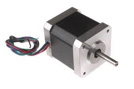

---
title: Materiales necesarios
layout: default
filename: 02_materiales.md
--- 
# Materiales necesarios

La lista de materiales se creó con el fin de optimizar y reutilizar la mayor cantidad de partes originales de la impresora 3D Overlord Pro+. En la siguiente lista se incorporan todos los elementos nuevos a adquirir, contemplando que los elementos originales existen y funcionan.

|                             **MKS GenL v1 (1 unidad)**                            |
|:-----------------------------------------:|:-------------------------------------------|
||Esta placa será la nueva placa de control de la impresora 3D. Será reemplazo de la placa original.|
|                         **Placa MKS Tiny Bee OPCIONAL**                         |
|:-----------------------------------------:|:-------------------------------------------|
|Si la placa MKS Gen-L v1.0 no se encuentra en el mercado (actualmente discontinuada), la placa [MKS TinyBee](https://github.com/makerbase-mks/MKS-TinyBee) es el reemplazo directo por el fabricante.||
|                     **Display RepRap (1 unidad)**                         |
|:-----------------------------------------:|:-------------------------------------------|
||Este panel reemplazará el panel original. ¿Por qué no puede utilizarse el original? La programación y funcionamiento del panel original solo es compatible con la placa original de la impresora. Este panel es un modelo genérico compatible tanto con la placa MKS Gen L v1.0 como también con muchísimas placas existentes en el mercado. Al adquirir el panel de usuario, vendrá un paquete con todos los elementos que hay en la imagen. En esta adaptación no usaremos la pequeña placa roja con conectores negros, solo se utilizará el panel y los dos cables grises.|
|                     **Driver A4988 o DRV8825 (4 unidades)**                         |
|:-----------------------------------------:|:-------------------------------------------|
|Se pueden utilizar cualquiera de los dos drivers: el A4988 (color rojo o verde comúnmente) o el DRV8825 (color violeta). La principal diferencia entre ambos drivers es que el DRV8825 soporta una corriente máxima de 2.5A, mientras que el A4988 soporta 2A.||
|                     **Multímetro**                         |
|:-----------------------------------------:|:-------------------------------------------|
||Este instrumento nos ayudará a realizar mediciones a lo largo de todo el proyecto.|
|                     **Soldador tipo lápiz y estaño**                         |
|:-----------------------------------------:|:-------------------------------------------|
|El soldador y el estaño nos ayudarán a hacer las uniones del cableado, principalmente en el caso de los ventiladores.||
|                     **Pinza y alicate**                         |
|:-----------------------------------------:|:-------------------------------------------|
||La pinza y el alicate son herramientas que pueden utilizarse durante el proceso.|
|                     **Perilleros**                         |
|:-----------------------------------------:|:-------------------------------------------|
|Los perilleros son otros elementos muy utilizados durante la implementación del proyecto.||
|                     **Destornilladores**                         |
|:-----------------------------------------:|:-------------------------------------------|
||Al igual que los perilleros, los destornilladores son otros elementos muy utilizados durante la implementación del proyecto.|
|                     **Termistor 100k b3950 (2 unidades)**                         |
|:-----------------------------------------:|:-------------------------------------------|
|El extrusor y la cama caliente llevan un termistor NTC 100K b3950 cada uno. Estos se encargan de sensar la temperatura de trabajo de la impresora 3D.||
|                     **Termocontraible (medidas: 1 y 2 mm)**                         |
|:-----------------------------------------:|:-------------------------------------------|
||El termocontraible se utilizará para cubrir empalmes que se deban hacer durante el procedimeinto.|
|                     **Tecla 24v**                         |
|:-----------------------------------------:|:-------------------------------------------|
|La tecla se encargará de encender o apagar el equipo desde el panel lateral.||
|                     **Bornera**                         |
|:-----------------------------------------:|:-------------------------------------------|
||La bornera conectará los hilos que provienen desde la fuente de alimentación.|
|                     **PC**                         |
|:-----------------------------------------:|:-------------------------------------------|
|La pc es necesaria para cargar el firmware de control en la placa principal de la impresora 3D.||
|                     **Cable USB Tipo B**                         |
|:-----------------------------------------:|:-------------------------------------------|
||Si trabajaremos con la placa MKS Gen-L, vamos a necesitar este cable para conectar la placa a la PC.|
|                     **Cable USB Tipo C**                         |
|:-----------------------------------------:|:-------------------------------------------|
|Si trabajaremos con la placa MKS TinyBee, vamos a necesitar este cable para conectar la placa a la PC.||

## A continuación se detallan las piezas originales que se reutilizan en este proyecto.

|                   **Motores NEMA**                               |
|:-----------------------------------------:|:-------------------------------------------|
||Se reutilizaron los cuatro motores originales de la impresora 3D. Tres para las columnas y uno para el sistema de extrusión del filamento.|

|                     **Cama caliente**                            |
|:-----------------------------------------:|:-------------------------------------------|
|Debido al material y a la dimensión, se utilizó la cama caliente original de la impresora 3D.||

|                     **Bloque Extrusor**                          |
|:-----------------------------------------:|:-------------------------------------------|
||El bloque extrusor original se utilizó de forma intacta, preservando el pico caliente, el bloque calentador, el disipador, el ventilador del disipador y el ventilador de capa.|

|                     **Coolers**                          |
|:-----------------------------------------:|:-------------------------------------------|
|Originalmente, el equipo tiene seis coolers. 3 en el extrusor: 1 para el disipador y 2 de capa. Coolers en el espacio de trabajo: 1 pequeño sobre el techo del área de trabajo y otro sobre el lateral, en una de las paredes de plástico transparente. Uno ubicado en la parte inferior interna de la impresora, lugar donde se ubican los motores y la electrónica del equipo.Únicamente se mantuvo el funcionamiento de los tres ventiladores del extrusor y el ventilador interno que refrigera la electrónica del equipo.||

|                     **Estructura**                          |
|:-----------------------------------------:|:-------------------------------------------|
||La estructura general del equipo se mantuvo intacta.|

|                     **Fuente de alimentación**                          |
|:-----------------------------------------:|:-------------------------------------------|
|Se reutiliza la fuente original de la impresora 3D, únicamente modificando su terminal de conexión.||

|                     **Finales de carrera**                          |
|:-----------------------------------------:|:-------------------------------------------|
|Se reutilizan los cuatros finales de carrera que presenta la impresora 3D: uno en la parte superior de cada comuna y uno en el extrusor.||

 