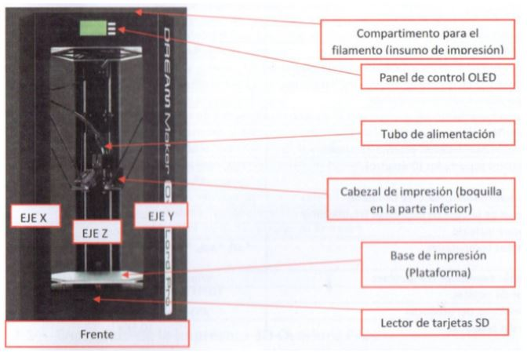

---
title: Planificación
layout: default
filename: 03_planificacion.md
--- 
# Planificación

La etapa de planificación, como muchas de este proyecto, son modificables a gusto de las personas que lo estén llevando a cabo. El orden de estas tareas son únicamente una sugerencia propuesta. La idea de este paso es retirar partes del gabinete que protegen  parte del cableado y otros módulos para poder realizar cómodamente el retiro de las partes que no se utilizarán, las modificaciones en las partes a reutilizar e instalar las partes nuevas. 

Antes de comenzar, es bueno tener presente una vista integral de la impresora. La misma se puede observar en las siguientes imágenes, donde además se indican las partes principales de la misma.

Teniendo presente esto, los pasos a seguir serían los siguientes:
* En el compartimiento superior, retirar la bobina de filamento que pueda estar utilizándose en la impresora 3D.
* Con un destornillador philips, retirar los paneles plásticos transparentes de los laterales y la tapa inferior que cubre la electrónica y parte del cableado de la impresora 3D.

* El la parte inferior, debe observarse algo como lo de la siguiente imagen.

* Remover el covertor “__spaghetti__” que reúne el tubo de teflón blanco con cables que terminan en la zona del extrusor.
* Remover los perfiles celestes de las columnas. Para hacer esto, con un destornillador philips, remover los tornillos desde la parte inferior de la impresora 3D y deslizar los perfiles como muestran las siguientes imágenes.

 