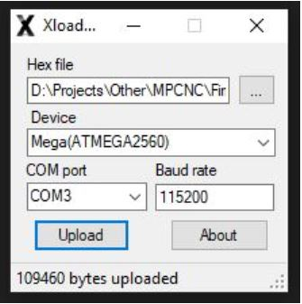
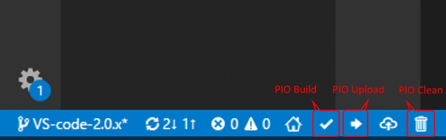
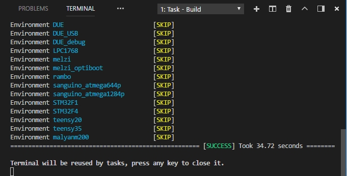

---
title: Instalación del firmware
layout: default
filename: 04_carga_firmware.md
--- 
# Antes de comenzar esta etapa

El firmware utilizado en este proyecto fue el Marlin 2.1.2. Se descargó el proyecto base desde la página oficial del __Proyecto Marlin__ y se modificó hasta lograr una versión funcional. La situación actual respecto al hardware (la placa MKS Gel-L v1.0 está discontinuada por el fabricante, pero aún se encuentran unidades a la venta. Se lanzó la placa [MKS TinyBee](https://github.com/makerbase-mks/MKS-TinyBee) como reemplazo) hace que **en este procedimiento mostremos la carga del firmware para ambas placas**.

Sin importar la placa con la que se trabaje, es importante tener una PC con los siguientes programas instalados:

* **Visual Studio Code**: IDE de programación mundialmente utilizado con el cual se puede modificar el código del firmware, compilarlo y cargarlo. De descarga desde este [link](https://drive.google.com/drive/folders/1mMvHacDkfZcnlTN5KPSEYk4WfQkbPL_f?usp=drive_link)
* **XLoader**: Programa para cargar archivos **.HEX** en la placa. Se descarga desde este [link](https://drive.google.com/drive/folders/1mMvHacDkfZcnlTN5KPSEYk4WfQkbPL_f?usp=drive_link).
* **Pronterface (Opcional)**: Programa para enviar comandos G a la impresora 3D y probar si la impresora interpreta bien los comandos. Se descarga desde este [link](https://www.pronterface.com/).

# Instalación del firmware en MKS Gen-L v1.0

Para instalar el firmware, proponemos dos opciones: 
* La primera opción es cargando el archivo **firmware.hex** mediante el programa **XLoader**, recomendada para usuarios que no tienen mucha experiencia en programación y prefieren hacerlo en pocos pasos. 
* La segunda opción es para usuarios que ya presentan alguna experiencia en programación, quieren explorar las opciones habilitadas dentro del código del Marlin o ya utilizaron los programas que se describieron más arriba. 

### Mediante programa XLoader



1. Conectar la placa a una PC mediante un cable USB Tipo B.
2. Con la placa conectada a la PC, abro el programa **XLoader**.
3. En _Device_, selecciono **Mega (ATMEGA2560)**.
4. En _COM port_, selecciono el puerto COM a donde tengo conectada la placa.
5. En _Hex File_, selecciono el archivo **.hex** (se descarga desde este [link](https://drive.google.com/drive/folders/1mMvHacDkfZcnlTN5KPSEYk4WfQkbPL_f?usp=drive_link))
6. Configurado todo, presiono el botón _Upload_.
7. Luego de unos segundos, en la parte inferior debe aparecer una leyenda como _“xxxxx bytes uploaded”_.
8. Listo, la placa ya tiene el firmware instalado.

>¿Qué es un archivo ```.hex```?
>
>Es un archivo con la información completa que queremos cargar en la placa, pero escrito en el _lenguaje_ que entiende la placa. Para explicarlo de una manera simple y sin demasiados detalles técnicos, cuando en programación hablamos de _“compilar código”_ el programa que ejecuta el proceso de compilación toma el archivo escrito en el lenguaje que hayamos trabajado nosotros (Por ejemplo, _lenguaje C_ o _C++_), verifica que no existan errores y finalmente genera el archivo resultado con extensión _.hex_.

>¿Qué es _código G_ O _G-Code_?
>
>El **G-Code** consta de comandos **G** y **M**, cada uno de ellos con un movimiento o acción asignado. La combinación de estos comandos permitirá a la impresora 3D entender qué patrón seguir con el fin de crear la pieza final. Entre los diferentes tipos de órdenes que interpreta la impresora 3D, encontramos comandos de movimiento, extrusión, calentamiento y detección en una secuencia.

### Mediante el programa Visual Studio Code

1. Con la placa conectada a la PC, abro el programa _Visual Studio Code_.
2. Instalar la extensión **Platformio** en el Visual Studio Code.
3. Abro el proyecto Marlin descargado desde este [link](https://drive.google.com/drive/folders/1mMvHacDkfZcnlTN5KPSEYk4WfQkbPL_f?usp=drive_link).
4. Una vez abierto el proyecto, me ubico en la barra inferior del programa y presiono la opción de **Upload** (tiene un icono de una flecha hacia la derecha).

    

5. Si no existió ningún problema, en la ventana **Console** debería aparecer un mensaje como el que muestra la siguiente imagen.

    

6. En caso de querer mas detalles del procedimiento, el el siguiente [link](https://marlinfw.org/docs/basics/install_platformio_vscode.html) se encuentra el procedimiento de carga explicado en el sitio del proyecto [Marlin](https://marlinfw.org/).

# Instalación del firmware en MKS TinyBee

Para cargar el firmware, también hay dos opciones: 
* Al igual que en el caso de la MKS Gen-L, la primera opción es cargando el archivo **firmware.bin** en una tarjeta microSD y energizar la placa mediante un cable USB C o la fuente de alimentación, opción recomendada para usuarios que no tienen mucha experiencia en programación y prefieren hacerlo en pocos pasos.
* La segunda opción es para usuarios que ya presentan alguna experiencia en programación, quieren explorar las opciones habilitadas dentro del código del Marlin o ya utilizaron los programas que se describieron más arriba.

### Mediante la carga del archivo **firmware.bin** en microSD

1. Descargar el archivo firmware.bin desde este [link](https://drive.google.com/drive/folders/1E1NkSHg_1MNqnraAo90TGFX9QdSg1mOr?usp=drive_link).
2. Cargar el archivo en una memoria micro SD manualmente.
3. Energizar la placa mediante un cable USB C a una PC o mediante la fuente de alimentación. Comenzará la instalación automáticamente.
4. Luego de que el firmware se haya instalado, extraer la memoria microSD. 
5. Para verificar que la instalación se hizo correctamente, abrir la memoria microSD en una PC. Si dentro de ella, hay un archivo **firmware.CUR**, esto indica que el firmware se instaló correctamente en la placa. Dicho archivo con extensión **.CUR** puede borrarse sin inconvenientes.

### Mediante el programa Visual Studio Code

1. Con la placa conectada a la PC, abro el programa _Visual Studio Code_.
2. Instalar la extensión **Platformio** en el Visual Studio Code.
3. Abro el proyecto Marlin descargado desde este [link](https://drive.google.com/drive/folders/1E1NkSHg_1MNqnraAo90TGFX9QdSg1mOr?usp=drive_link).
4. Una vez abierto el proyecto, me ubico en la barra inferior del programa y presiono la opción de **Upload** (tiene un icono de una flecha hacia la derecha).

    

5. Si no existió ningún problema, en la ventana **Console** debería aparecer un mensaje como el que muestra la siguiente imagen.

    

6. En caso de querer mas detalles del procedimiento, el el siguiente [link](https://marlinfw.org/docs/basics/install_platformio_vscode.html) se encuentra el procedimiento de carga explicado en el sitio del proyecto [Marlin](https://marlinfw.org/).

[](./03_planificacion.html) [](./05_adapt_hardware.html)