---
title: Adaptación del hardware
layout: default
filename: 05_adapt_hardware.md
--- 
# Adaptación del hardware

En la sección [Planificación](./03_planificacion.html), se retiraron las partes de la estructura que cubren y protegen el cableado y la electrónica de la impresora 3D. Esto se hizo con el objetivo de despejar las zonas por las que se modificará el cableado original, se cambiarán los sensores y la electrónica de control.

Si la etapa de _Planificación_ fue realizada, la adaptación del hardware debe hacerse de forma ordenada, buscando que no exista ninguna confusión en el conexionado.
Antes de empezar con la adaptación del hardware, es importante saber que, debido a la [geometría delta](https://reprap.org/wiki/Delta_geometry) de la impresora 3D, el equipo tiene mucha extensión de partes cableadas. Para entender la estructura general de este cableado es importante tener los siguientes puntos bien presentes:

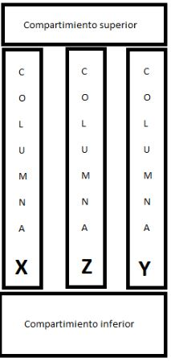

* La alimentación eléctrica que proviene de la fuente de alimentación de 24v ingresa desde un lateral del compartimiento inferior de la impresora 3D, de la misma manera que en el esquema original.
* Los motores de los tres ejes y del extrusor se encuentran en el compartimiento superior.
* El final de carrera asociado a cada eje se ubica debajo de cada motor, sobre cada columna.

    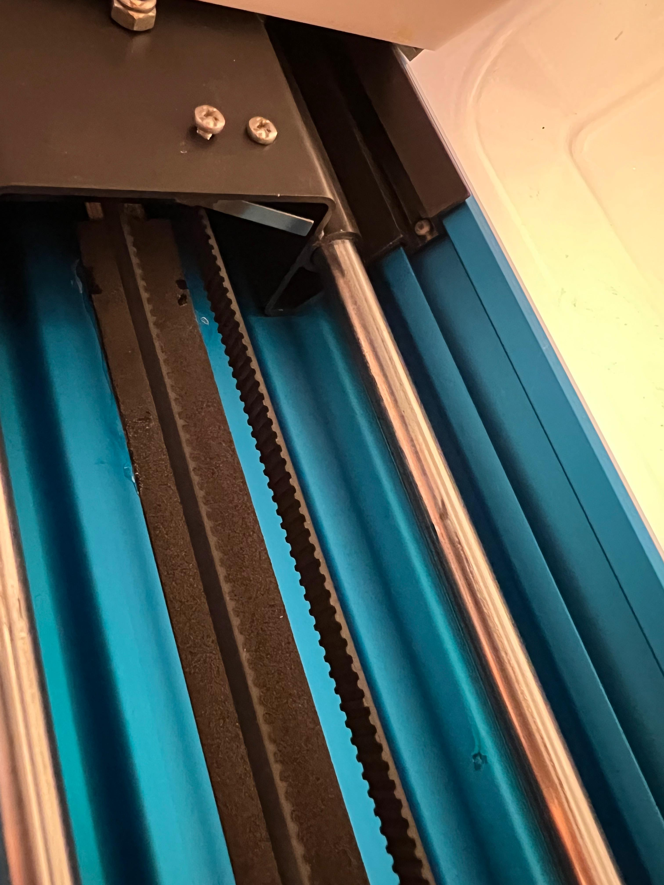

* El motor del extrusor se ubica dentro del compartimiento superior.

    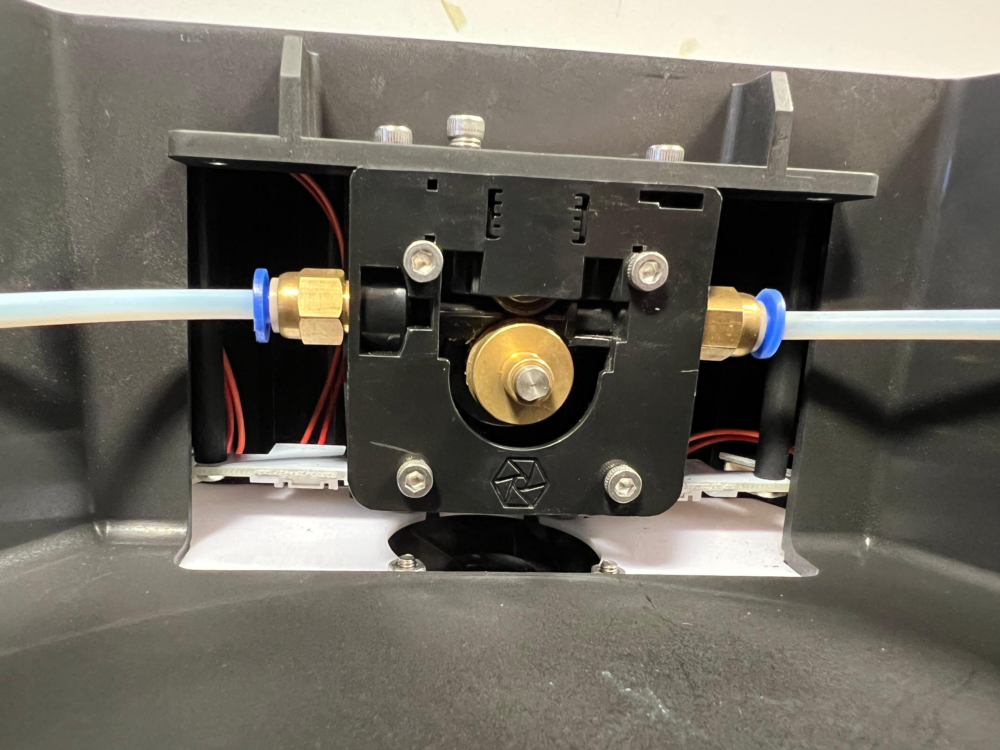

* En un costado de la parte interna del compartimiento superior, se ubica una placa pequeña, la cual interconecta todo el cableado eléctrico de algunos de los elementos que trabajan en bloque extrusor

    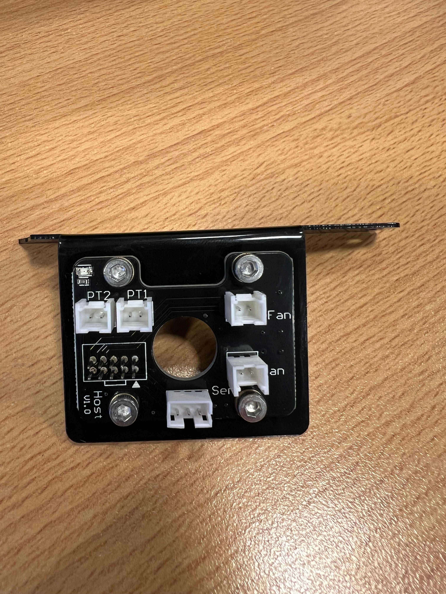

    Mediante un multímetro, es muy importante poder revisar el conexionado de todos los elementos que pasan por esta placa. Esto último ayudará a realizar el conexionado de los periféricos a la placa MKS.

* En el compartimiento inferior se ubica la placa de control MKS que controla la impresora 3D. Por las columnas desciende el cableado de todos los elementos que trabajan en el extrusor (coolers, calefactor 24v, termistor 100k).

## ¿Qué cables y elementos llegan al bloque extrusor?

Todos los elementos que llegan al extrusor lo hacen agrupados mediante un _spaghetti_. Estos elementos son los siguientes:

* Tubo de nylon por donde llega el filamento
* Cable del calefactor de 24V
* Cable del termistor NTC del bloque calentador
* Cable de 24v para los dos ventiladores de capa
* Cable de 24v para el ventilador del disipador

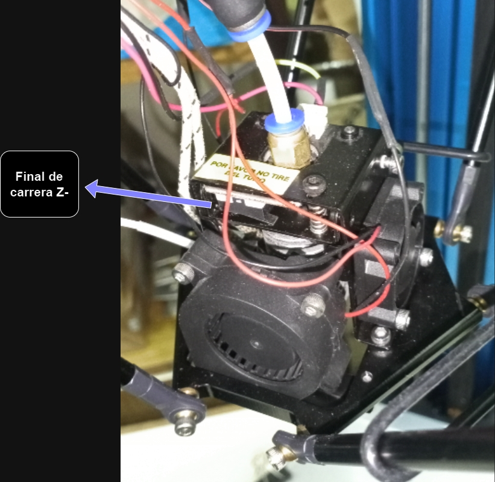
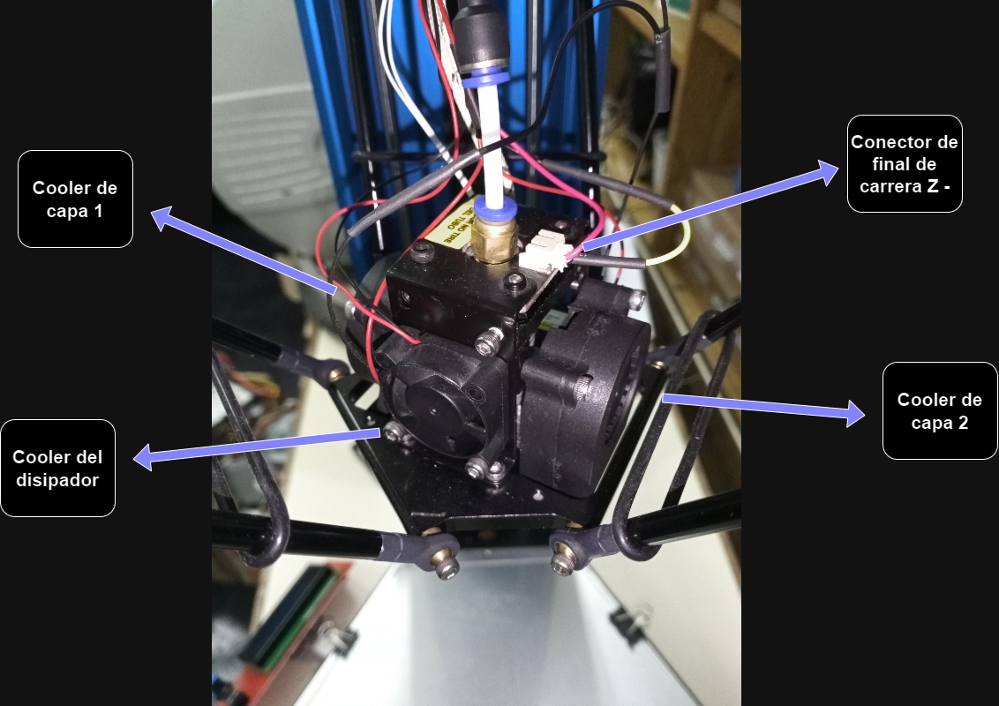
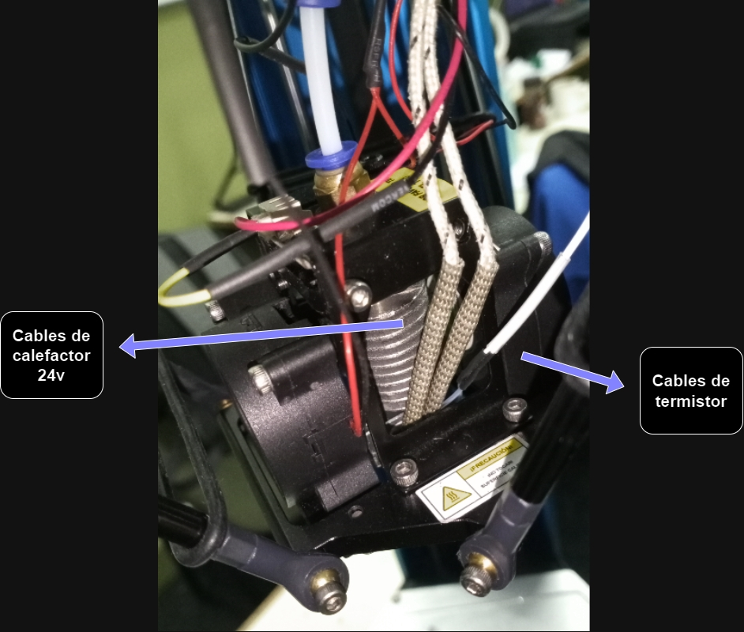
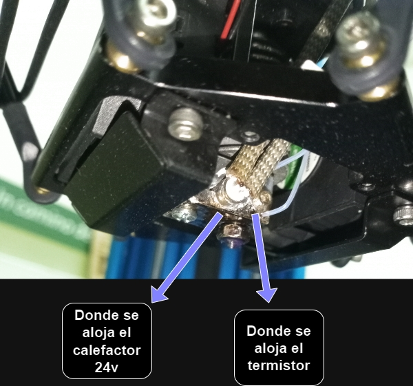

## Calibración de los drivers

El proceso de calibración de los drivers utilizados por los motores NEMA se muestra detalladamente en este [video](https://www.youtube.com/watch?v=GzAly4MJ4PU) para el driver **A4988** y este [video](https://www.youtube.com/watch?v=m1fOqq5GYDA) para el driver **DRV8825** _(Audio en inglés, pero tiene subtitulos en español)_.

## Adaptación de la fuente de alimentación

La fuente de alimentación original presenta en su cable un conector hembra de cuatro pines (dos para +24v y dos para GND). El conector macho es propio de la placa de control original del equipo. Dado que no es un conector fácil de encontrar en el mercado local, en este caso se reemplazó por una simple bornera de dos pines. Esto puede reemplazarse por otro conector que sea del gusto del usuario.

A continuación, están las imágenes del conector original del cargador y el conector original en el chasis de la impresora.

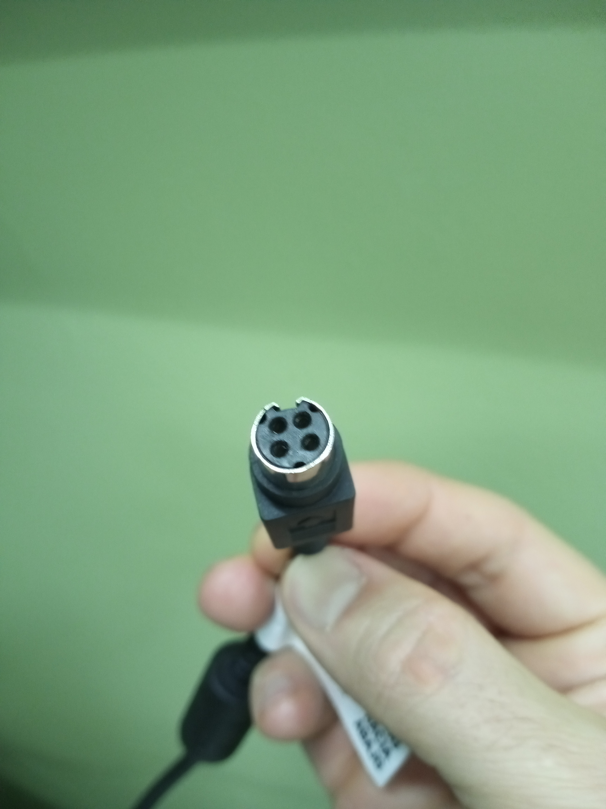
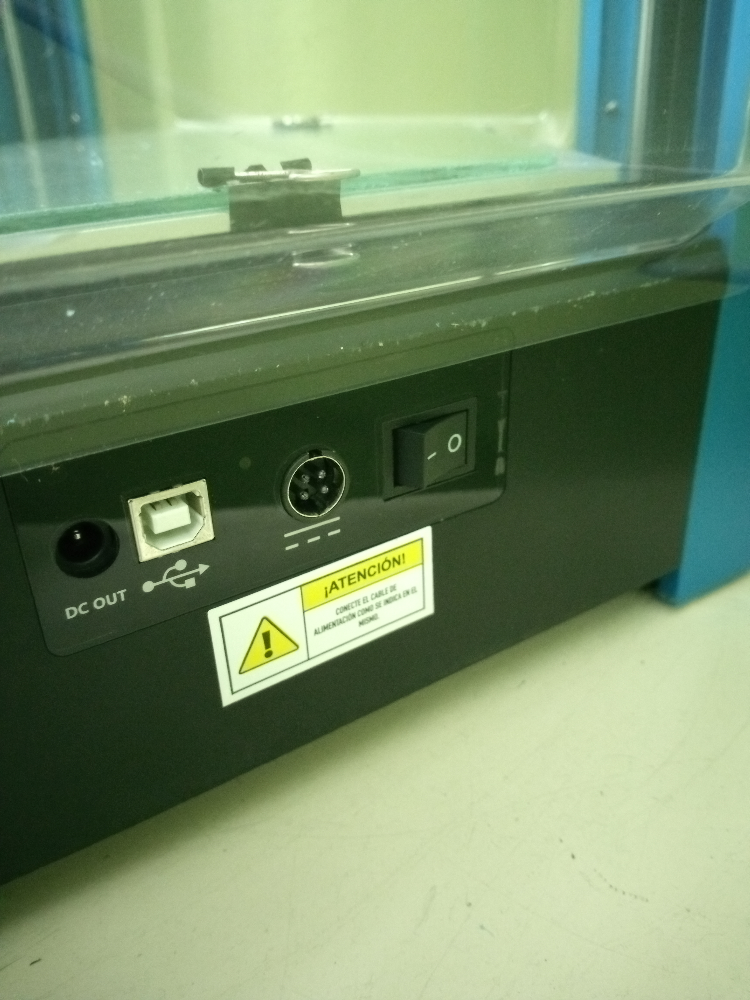

A continuación, están las imágenes donde se retira el conector y se dejan los dos cables libres y la bornera de dos pines para atornillar. El cable celeste y marrón son los de +24v y GND que ingresan a la impresora y alimentan todos los circuitos.

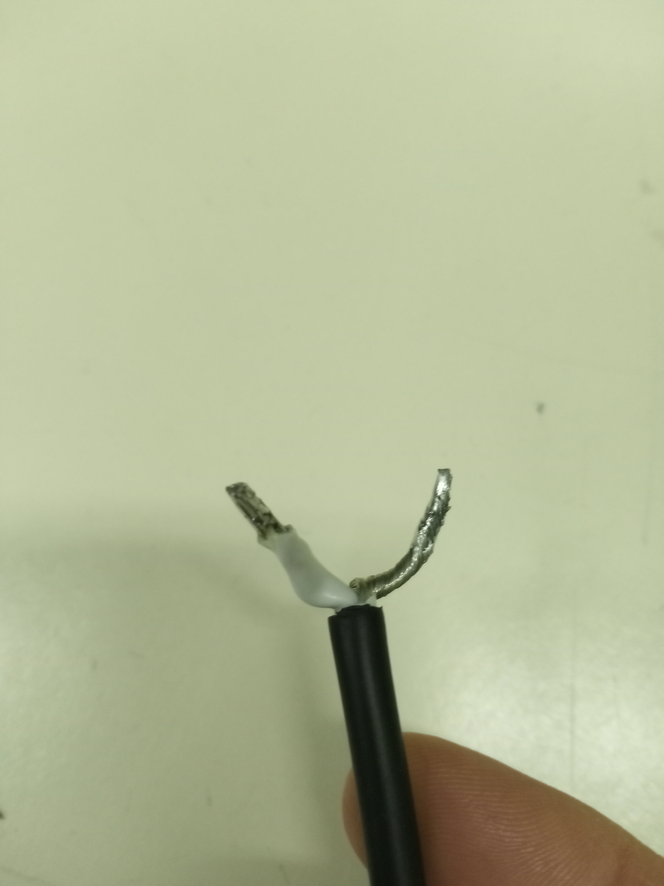

 