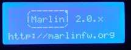
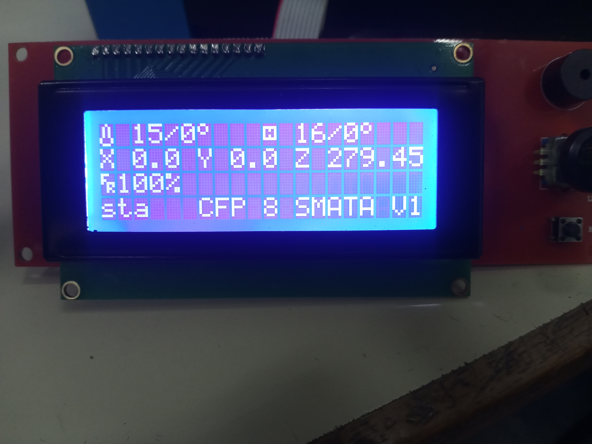

---
title: Puesta en marcha
layout: default
filename: 06_puesta_marcha.md
--- 
# Puesta en marcha

Antes de comenzar a usar la impresora 3D por primera vez, es importante realizar una verificación de distintos módulos con el objetivo de prevenir algún posible accidente. Dado esto, es importante:

* Con un multímetro, verificar que la fuente de alimentación entrega el voltaje correcto.
* Verificar el cableado interno del equipo, asegurando que los cables se enreden en el área de movimiento de los motores.
* Verificar la integridad de las correas en los tres ejes.
* Inspeccionar el extrusor y controlar todas las conexiones eléctricas que existen en él.
* Verificar las conexiones de todos los elementos en las placa de control.

Si los los chequeos anteriores fueron realizados, avanzar con el encedido del equipo. El display se encenderá y aparecerá un menú como el de las siguientes imágenes.

 
