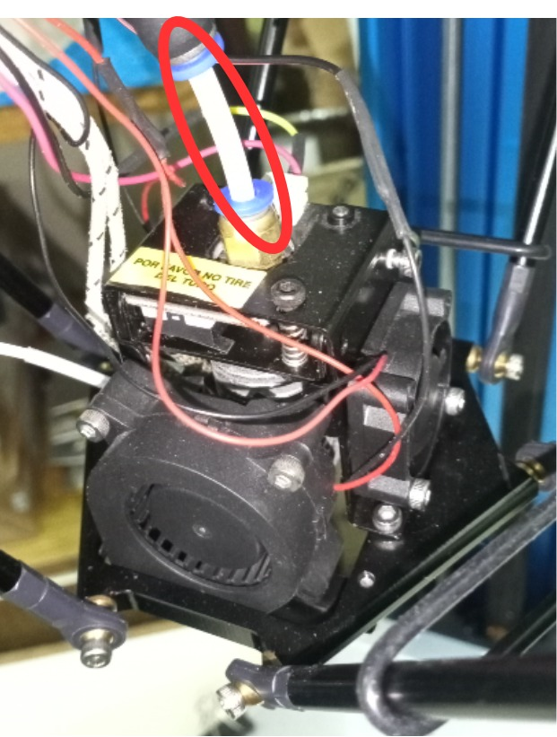

---
title: Mi primera impresión
layout: default
filename: 08_primera_impresion.md
--- 
# Mi primera impresión

La impresora 3D se opera de la misma manera que cualquier impresora 3D comercial.

1. Verificar que la cama caliente no presente suciedad. En caso de que si exista, limpiarlo con alcohol y un paño. 
2. Verificar que haya filamento cargado en la impresora.
3. Cargar el archivo .gcode a imprimir dentro de una memoria SD.
4. La memoria SD se inserta en el slot ubicado en el lateral del display LCD.
5. Al insertar la memoria SD, aparecerá la leyenda _SD/FD insertado_
6. Para lanzar la impresión, presionar el encoder, ir a la opción _Imprimir desde SD/FD_ y seleccionar el archivo a imprimir.

RECOMENDACION: En caso de atasco, nunca remover el tramo inferior del tubo de teflón (se muestra en la siguiente imagen) ya que su mal posición puede generar un desborde del filamento fundido y un posterior tapón y atasco de plástico.

# Demo

En el siguiente [link](https://drive.google.com/file/d/11Ifzz-wFGjBvnHKF1wgRUvqJJxLNcwyR/view?usp=sharing) se accede a un video demostración de la impresora 3D en funcionamiento. La impresión que se muestra en el video se realiza a 90 mm/s.

 