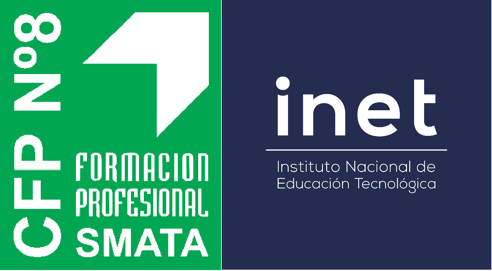

---
title: Agradecimientos
layout: default
filename: 09_agradecimientos.md
--- 
# Agradecimientos
Este proyecto fue logrado gracias al apoyo y al trabajo del Centro de Formación Profesional Nº8 - SMATA y del INET. Este tipo de proyectos busca poner en valor recursos de las instituciones educativas de una forma simple y accesible, para que estudiantes y docentes de distintas puntos del país puedan poner en práctica los conocimientos vinculados a distintas áreas que son parte de la educación técnica como la robótica, el diseño y la impresión 3D, la electrónica, la programación y demás.

Invitamos a todos los interesados a que puedan llevar adelante este tipo de proyectos y que puedan fomentar su creatividad y trabajo en equipo con el objetivo de apoyar el desarrollo de recursos educativos. Que la tecnología sea un medio de intercambio de ideas y motivaciones para todos los estudiantes.

