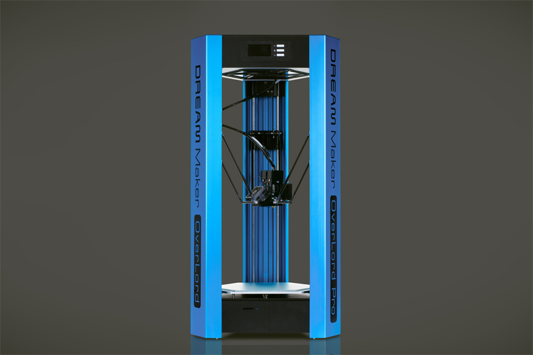

# Adaptación de impresora 3D Overlord Pro+

El proyecto consiste en convertir la impresora 3D Overlord Pro+, de la empresa china Dream Maker, en una versión adaptable, de bajo costo, realizada con insumos mundialmente ultilizados por la comunidad maker y de facil acceso a nivel nacional.
